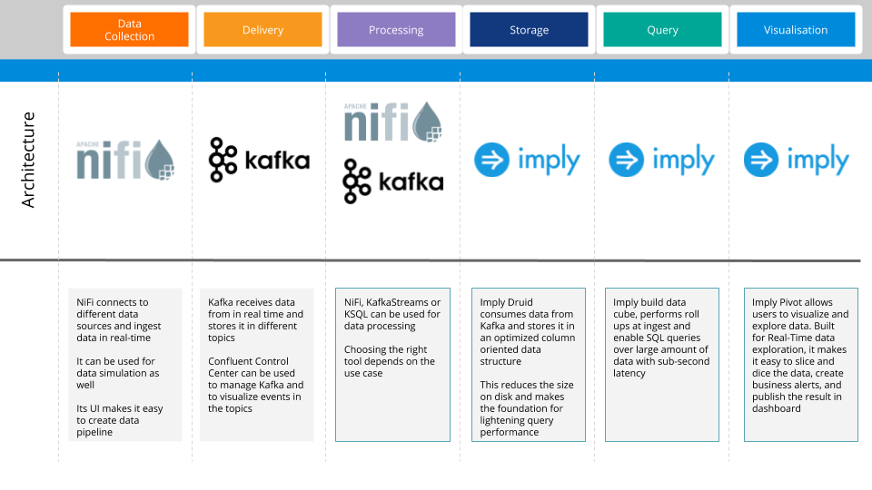
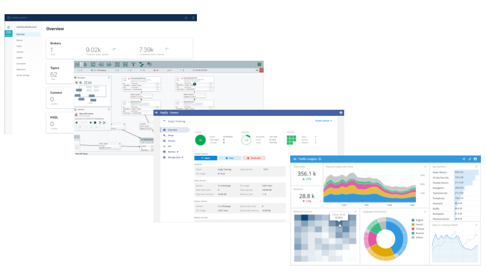

# Overview

This [docker-compose.yml](docker-compose.yml) deploy a complete Streaming Analytics Platform based on Imply IAP. It runs all the services in containers in your local host, enabling you to build your own development environments. The scripts deploy the following architecture:



# Requirements

To use this scripts, you need:
* An Imply license to put in the [env.list](env.list) file. Replace the YOU-IMPLY-LICENSE by your own license key that you got from Imply.
* Enough CPU and RAM on your machine. The script runs a full streaming platform with several distributed systems so make sure to give it enough resources (I am using 4 CPUs and 4 GB of RAM). Here's how you can allocate more resources to your Docker: https://docs.docker.com/docker-for-mac/#resources

# How to use

To use this Docker setup, run the following commands:

```
git clone https://github.com/ahadjidj/SuperFactory.git
cd SuperFactory/iap-all-in-one
vi env.list # Edit the file to set your own license
docker-compose up
```
Watch the execution of the script. After some time, you should be able to access the following services:

* Imply Manager : http://localhost:9097
* Imply Pivot : http://localhost:9095
* NiFi : http://localhost:8080
* Kafka Control Center : http://localhost:9021



Kafka is accessible to the other containers on kafka:29092

A good place to start using the platform is here : https://docs.imply.io/on-prem/quickstart

You can stop your pltform with `docker-compose stop` 

When you finish your development, you can remove your containers with `docker-compose rm`

Happy geeking
